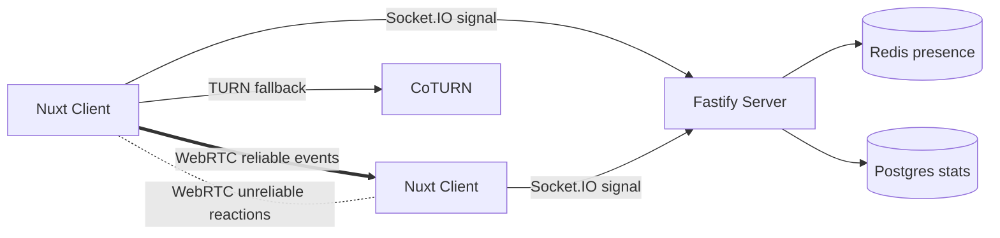

# UNO Real-Time Multiplayer Platform

A greenfield Nuxt 3 + Fastify + WebRTC monorepo for a premium real-time multiplayer UNO game. Gameplay is peer-to-peer over WebRTC data channels while the backend handles rooms, invite links, signaling, persistence hooks, reconnect assistance, and anti-cheat audit points.

## Quick Start

```bash
pnpm install
pnpm dev
```

For local infrastructure:

```bash
docker compose -f infra/docker-compose.yml up -d
```

## Architecture



## Phase Status

- Phase 1: deterministic engine, RNG, deck, rules, sort, tests.
- Phase 2: room API, invite JWT, Socket.IO signaling, Coturn dev config.
- Phase 3: topology selector, hash-chain sync, reconnect policy, WebRTC wrappers.
- Phase 4: Nuxt onboarding/room pages, Pinia stores, Vue UI primitives, Pixi scene helper.
- Phase 5: bot difficulties with legal-move guarantees.
- Phase 6: reduced-motion-aware sound controller and performance-oriented scene hooks.
- Phase 7: CI, docs, Docker, placeholder audio manifest, E2E smoke target.

## Commands

- `pnpm test`: package unit/integration tests.
- `pnpm typecheck`: TypeScript checks.
- `pnpm build`: package/app builds.
- `pnpm test:e2e`: Playwright smoke tests.

Guest identity is local-first and account-free. Invite URLs use `/room/{roomId}?token={inviteToken}`. Small rooms use full mesh, medium rooms selective mesh, and 11-16 player rooms host-star with relay fallback. The server does not run continuous gameplay logic.
